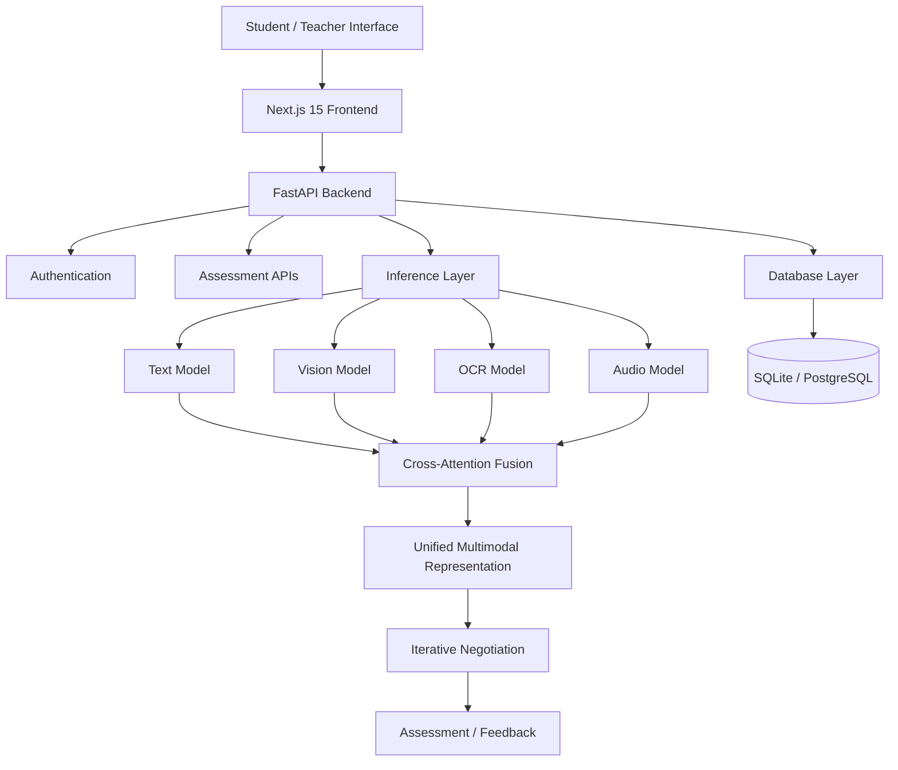

# <p align="center">🌷 RIMN</p>

<p align="center">
  <strong>Recursive Iterative Modality Negotiation Network</strong>
</p>

<p align="center">
  <em>Multimodal Intelligence for Unified Educational Understanding & Assessment</em>
</p>

<p align="center">


</p>

---

<p align="center">

### ✦ Read the answer. See the evidence. Hear the context. Understand the whole response. ✦

</p>

---

## 🤎 About RIMN

**RIMN (Recursive Iterative Modality Negotiation Network)** is a multimodal AI system designed for **educational understanding and assessment**.

Instead of treating an answer as text alone, RIMN is designed around the idea that meaningful assessment can require multiple forms of evidence:

```text
Text
Handwritten Work
Images
Diagrams
Audio
   ↓
Multimodal Understanding
   ↓
Cross-Attention Fusion
   ↓
Iterative Modality Negotiation
   ↓
Unified Representation
   ↓
Assessment / Feedback
````

The repository combines a modern AI backend, multimodal inference components, student/teacher-facing interfaces, authentication, database support, model tooling, and containerized infrastructure into one full-stack system.

---

# 🌸 The RIMN Idea

Educational responses are rarely purely textual.

A learner may answer through:

* written explanations
* handwritten solutions
* diagrams
* visual reasoning
* spoken responses
* combinations of several modalities

RIMN is designed to process these heterogeneous signals within a unified assessment workflow.

At the center of the system is a **512-dimensional latent representation** intended to bring different modalities into a common representational space.

---

# ✨ Core Capabilities

## 📝 1. Text Understanding

RIMN includes a dedicated textual understanding pathway intended for educational responses and assessment.

The repository identifies **DeBERTa-v3** as the text-model component.

```text
Text Input
   ↓
Tokenization
   ↓
Text Representation
   ↓
Semantic Features
   ↓
Multimodal Fusion
```

---

## 👁️ 2. Visual Understanding

Visual evidence can be incorporated alongside text to support multimodal educational reasoning.

The repository identifies **SigLIP / CLIP-style vision models** within the visual stack.

This enables the system to reason over visual context such as:

```text
Images
Diagrams
Visual Evidence
Question Illustrations
```

rather than relying exclusively on textual tokens.

---

## ✍️ 3. Handwritten Answer Understanding

RIMN also accounts for handwritten responses through an OCR-oriented pipeline.

The repository identifies **TrOCR** as the OCR model component.

```text
Handwritten Answer
        ↓
Image Processing
        ↓
OCR
        ↓
Text Representation
        ↓
Multimodal Fusion
```

This connects handwritten student work to the same downstream assessment pipeline.

---

## 🎙️ 4. Audio Understanding

Audio is treated as another source of educational evidence.

The repository identifies **Whisper** within its audio-processing stack.

```text
Audio Response
      ↓
Speech Recognition
      ↓
Transcribed Representation
      ↓
Multimodal Reasoning
```

This makes the architecture suitable for assessment workflows in which learners respond verbally.

---

# 🧠 Cross-Attention Fusion

RIMN's central multimodal concept is **Cross-Attention Fusion**.

Rather than simply concatenating independent modality vectors, cross-attention is intended to allow information from one modality to influence how another modality is interpreted.

Conceptually:

```text
        ┌───────────┐
        │   TEXT    │
        └─────┬─────┘
              │
              ▼
        ┌───────────┐
        │           │
        │ CROSS     │
        │ ATTENTION │
        │           │
        └─────┬─────┘
              ▲
              │
        ┌─────┴─────┐
        │   VISION  │
        └───────────┘

              +

        AUDIO / OCR / OTHER EVIDENCE
```

The goal is to produce a more context-aware multimodal representation.

---

# 🔄 Recursive Iterative Modality Negotiation

The defining concept behind RIMN is its **Iterative Negotiation Loop**.

The system is designed around repeated interaction between modalities rather than treating fusion as a single static operation.

A conceptual workflow is:

```text
              ┌───────────────────────┐
              │   Modal Observations  │
              └──────────┬────────────┘
                         ↓
               ┌───────────────────┐
               │ Cross-Modal Fusion│
               └─────────┬─────────┘
                         ↓
               ┌───────────────────┐
               │ Shared 512-D Space│
               └─────────┬─────────┘
                         ↓
               ┌───────────────────┐
               │ Evaluate Agreement│
               │ / Evidence        │
               └─────────┬─────────┘
                         ↓
               ┌───────────────────┐
               │ Iterative Update  │
               └─────────┬─────────┘
                         │
                         └──────────────↺
```

This architectural idea is intended to help the system reconcile information across different evidence sources.

---

# 🔎 Contradiction Awareness

A multimodal answer can contain disagreement between modalities.

For example:

```text
Written Explanation
       +
Diagram
       ↓
Do they support
the same conclusion?
```

RIMN explicitly includes **contradiction detection** as part of its intended assessment capabilities.

This can be useful when text and visual evidence communicate different interpretations.

---

# 💡 Explainable Assessment

RIMN is designed with explainability in mind rather than limiting output to a single score.

The project describes explainability components such as:

```text
Assessment Result
      ↓
Reasoning / Evidence Trace
      ↓
Relevant Multimodal Evidence
      ↓
Attention / Visual Interpretation
```

The intent is to make assessment outcomes more inspectable for educators and learners.

---

# 🎓 Designed for Education

RIMN is structured around educational assessment use cases rather than generic multimodal classification.

Potential assessment inputs include:

| Modality       | Example                |
| -------------- | ---------------------- |
| 📝 Text        | Written answer         |
| ✍️ Handwriting | Handwritten solution   |
| 🖼️ Vision     | Diagram / image        |
| 🎙️ Audio      | Spoken response        |
| 🔗 Multimodal  | Text + diagram + image |

This enables a single assessment workflow to work across multiple response formats.

---

# 🧩 Full-Stack Architecture

RIMN is organized as a multi-layer application.



---

# 🌷 Technology Stack

| Layer                         | Technology                    |
| ----------------------------- | ----------------------------- |
| **Frontend**                  | Next.js 15                    |
| **UI**                        | React 19                      |
| **Language**                  | TypeScript                    |
| **Styling**                   | TailwindCSS                   |
| **Motion**                    | Framer Motion                 |
| **Charts**                    | Recharts                      |
| **Backend**                   | FastAPI                       |
| **Server**                    | Uvicorn                       |
| **ML Framework**              | PyTorch                       |
| **Text**                      | DeBERTa-v3                    |
| **Vision**                    | SigLIP / CLIP                 |
| **OCR**                       | TrOCR                         |
| **Audio**                     | Whisper                       |
| **Database ORM**              | SQLAlchemy                    |
| **Local Database**            | SQLite / aiosqlite            |
| **Production DB Support**     | PostgreSQL                    |
| **Authentication**            | JWT                           |
| **Generative AI Integration** | Google Gemini                 |
| **Containerization**          | Docker / Docker Compose       |
| **Deployment**                | Render configuration included |

---

# 🏗️ Repository Structure

```text
RIMN/
│
├── backend/
│   ├── api/
│   ├── auth/
│   ├── db/
│   ├── inference/
│   ├── config.py
│   ├── main.py
│   ├── seed.py
│   ├── Dockerfile
│   └── requirements.txt
│
├── frontend/
│   ├── app/
│   ├── components/
│   ├── lib/
│   └── ...
│
├── ml/
│   ├── data/
│   ├── evaluation/
│   ├── models/
│   ├── training/
│   └── train_advanced.py
│
├── infra/
│   ├── docker-compose.yml
│   └── .env.example
│
├── scratch/
│   ├── model checks
│   ├── Gemini tests
│   ├── tokenizer tests
│   └── grading tests
│
├── uploads/
│
├── .env.example
├── render.yaml
├── requirements-render.txt
└── README.md
```

---

# 🔐 Authentication & Backend Services

The backend includes dedicated infrastructure for:

```text
Authentication
User management
JWT-based sessions
Database access
Assessment APIs
Inference services
Configuration
```

The project also contains database seed/check utilities and authentication test scripts.

---

# 🗄️ Data Layer

RIMN supports a lightweight local database configuration through:

```text
SQLite
+
aiosqlite
+
SQLAlchemy
```

The environment configuration also supports PostgreSQL deployments.

Example database configuration:

```text
DATABASE_URL=sqlite+aiosqlite:///./rimn.db
```

---

# 🤖 Generative AI Integration

The backend includes Google Gemini integration through environment configuration.

The repository exposes:

```text
GEMINI_API_KEY
```

as part of its application configuration.

This creates an additional generative-AI pathway alongside the project's dedicated multimodal ML components.

---

# 🧪 Machine Learning Layer

The `ml/` directory separates the research and modelling workflow from the production API.

It contains dedicated areas for:

```text
Data
Models
Training
Evaluation
Advanced Training
```

The repository includes an advanced training entry point:

```bash
python ml/train_advanced.py
```

Model inspection and experimentation utilities are also present under `scratch/`.

---

# 📊 Benchmarking

The current project documentation includes ScienceQA benchmark figures as an experimental reference.

| Modality         | Baseline | RIMN-MVP | RIMN-Full |
| ---------------- | -------: | -------: | --------: |
| **Text-Only**    |    65.2% |    78.4% |     84.1% |
| **Text + Image** |    72.1% |    82.5% | **91.3%** |

These figures are presented in the repository as benchmark results for the documented configurations and should not be interpreted as universal production performance.

---

# 🐳 Dockerized Development

RIMN includes Docker and Docker Compose infrastructure.

From the `infra/` directory:

```bash
cd infra
docker-compose up --build
```

The documented development services expose:

```text
Frontend
http://localhost:3000

Backend API
http://localhost:8000

Interactive API Documentation
http://localhost:8000/docs
```

---

# 💻 Local Development

## Backend

```bash
cd backend

pip install -r requirements.txt

uvicorn main:app --reload
```

---

## Frontend

```bash
cd frontend

npm install

npm run dev
```

---

# 🔑 Environment Configuration

Copy the example environment file:

```bash
cp .env.example .env
```

Configure the required values:

```env
GEMINI_API_KEY=your-gemini-api-key
SECRET_KEY=your-secret-key
DATABASE_URL=sqlite+aiosqlite:///./rimn.db
FRONTEND_URL=http://localhost:3000
ENVIRONMENT=development
```

Never commit real API keys or secrets.

---

# ☁️ Deployment

The repository includes a Render Blueprint configuration.

The documented deployment stack uses:

```text
Render
   ↓
FastAPI Backend
   ↓
Uvicorn
```

The provided configuration includes environment variables for:

```text
GEMINI_API_KEY
SECRET_KEY
FRONTEND_URL
ENVIRONMENT
PYTHON_VERSION
```

For production deployments, secret values should be configured through the hosting platform rather than committed into the repository.

---

# 🧠 Modality Flow

The conceptual RIMN pipeline can be summarized as:

```text
       ┌──────────┐
       │   TEXT   │
       └────┬─────┘
            │
       ┌────▼─────┐
       │  VISION  │
       └────┬─────┘
            │
       ┌────▼─────┐
       │   OCR    │
       └────┬─────┘
            │
       ┌────▼─────┐
       │  AUDIO   │
       └────┬─────┘
            │
            ▼
   ┌──────────────────┐
   │ Cross-Attention   │
   │ Fusion            │
   └────────┬─────────┘
            ▼
   ┌──────────────────┐
   │ Shared 512-D      │
   │ Representation    │
   └────────┬─────────┘
            ▼
   ┌──────────────────┐
   │ Iterative         │
   │ Negotiation Loop  │
   └────────┬─────────┘
            ▼
   ┌──────────────────┐
   │ Unified Educational│
   │ Understanding      │
   └────────┬─────────┘
            ▼
       Assessment
```

---

# 🌼 Why Multimodal Assessment Matters

A single student answer may contain more information than any one modality can represent.

A diagram can clarify a written explanation.

A handwritten derivation can reveal intermediate reasoning.

An audio response can provide information unavailable in a short textual answer.

RIMN is built around the principle that these signals can be considered together rather than independently.

---

# 🛠️ Development Utilities

The repository includes several engineering utilities for validating components during development.

Examples include:

```text
Database checks
Authentication tests
Password tests
Model inspection
Tokenizer tests
Gemini connectivity tests
Grading tests
Environment verification
```

These utilities support iterative development and debugging of the larger multimodal system.

---

# 📚 Research Context

RIMN was developed as part of the **6th Semester Experiential Learning (EL)** work at:

**RV College of Engineering (RVCE)**

### Team

**Learning Lynx**

### Mentor

**Dr. Prof. Somesh Nandi**

---

# 🌱 Future Scope

The architecture provides room for continued experimentation in areas such as:

```text
• Stronger multimodal encoders
• More advanced modality negotiation
• Fine-grained educational rubrics
• Larger multimodal assessment datasets
• Better contradiction detection
• Improved explainability
• Human-in-the-loop grading
• Personalized learning feedback
• Multimodal longitudinal analytics
• Model evaluation across additional educational benchmarks
```

---

# ⚠️ Project Notes

RIMN combines research-oriented machine-learning components with a deployable full-stack application.

The repository should therefore be understood as both:

> **an experimental multimodal AI architecture**

and

> **a working educational technology prototype.**

Benchmark values, model targets, and architectural ambitions depend on the particular models, datasets, configurations, and evaluation procedures used.

---

# 💗 Philosophy

> ### **Education is multimodal. Understanding should be too.**

RIMN explores a future in which educational assessment does not stop at reading an answer.

It looks at the answer.

It interprets the diagram.

It processes the handwriting.

It listens to the response.

And it brings those signals together into a unified understanding.

---

<p align="center">

## 🌷 RIMN

<strong>Recursive Iterative Modality Negotiation Network</strong>

<br>

<em>One learner. Many modalities. One unified understanding.</em>

<br><br>

**Built with ♡ by Priyam Parashar**

</p>
```

